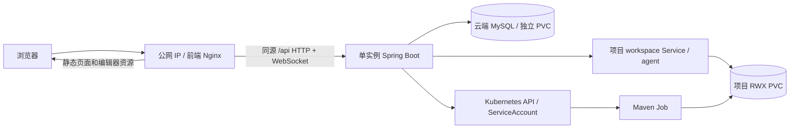

# Manao 6B：单用户工作台完整迁云实施计划

> **For agentic workers:** 实施时使用 `superpowers:subagent-driven-development` 或 `superpowers:executing-plans`，按下面的任务和退出条件推进。本次交付是问诊结论与实施文档，不代表已经部署或验收。

**Goal:** 不依赖开发电脑上的服务、数据库或隧道，仅用浏览器访问服务器公网 IP，就能完成当前 6A 已验收的开发生命周期。

**Architecture:** 在现有 Kubernetes 集群运行前端 Nginx、单实例 Spring Boot 和持久化 MySQL；复用现有 workspace-agent、项目 PVC 和 Maven Job。浏览器通过一个入口访问静态页面、同源 API 和日志 WebSocket，后端使用集群内 ServiceAccount 与 Service DNS。

**Tech Stack:** 现有 React/Vite/Monaco、pnpm 10.33.0、Java 17、Spring Boot 3.5.9、Fabric8 7.7.0、MySQL、Kubernetes；增加前端 Nginx 静态托管与反向代理，不升级业务依赖。

**Spec:** 本文第 1–5 节是六轮问诊形成的需求与设计依据，第 6 节是执行计划；合并为一份文档，避免维护重复口径。

**基线：** 2026-09-18；工作树 `.worktree/poc4-stage-6b`；分支 `codex/poc4-stage-6b`；核查 HEAD `0a7d8635bb0b1f83903c7ba1efb15ddf8bcede94`。

## 全局约束

- 6A 阶段结论以 [Stage6A-Current-Facts.md](../../Stage6A-Current-Facts.md) 为准：已按 MVP 生命周期接受。历史完整工程矩阵未全部通过，不重新把它设为 6B 的前置门禁。
- 仅本人使用；全新数据；公网 IP，无域名；允许部署更新、服务重启期间短暂不可用，恢复后刷新或重新登录。
- 已保存文件和项目必须跨服务重启保留；不承诺保存未显式提交的浏览器缓冲，也不承诺运行任务在服务器故障中无中断。
- 保留 owner 校验、文件 revision、Run 状态、日志回放、操作回执与手动删除语义；传输结果不确定时先对账，不盲目重放写请求。
- 前端使用 pnpm；文档和新脚本使用 UTF-8 无 BOM。实现从上述工作树开始，保留其他人的改动。
- 不迁移旧测试数据；新部署使用独立 namespace/schema。旧资源清理不是新环境部署的隐含步骤。

## 1. 最开始的问题

“将当前工作台在保留当前能力的同时完整迁移至云端，使用户体验与当前 6A 无异；遵循第一性原理、不做过度工程化，形成真正值得执行的实施文档。”

这是一个**目标与价值判断**：“完整”“当前能力”“体验无异”最初尚无可执行边界，不能直接解释为完整产品化、所有源码功能都验收或高可用。

## 2. 真正要解决的问题

**把已可用的 6A 开发闭环，从依赖开发电脑的混合运行方式，交付为本人可通过公网 IP 独立使用的云端工作台。**

判断迁移完成的关键是运行依赖是否全部在服务器侧，而不只是“后端出现了一个 Pod”。开发电脑可以用于构建、部署和观察，但它退出后不能影响工作台使用。

“体验保持”具体指：界面和操作顺序保持；编辑、保存、运行、日志、结果、再次修改运行、删除保持；刷新和重新登录后仍能继续使用已有数据。用户接受维护中断。问诊没有给出严格的延迟等值或可用率承诺，实施时记录实际耗时，不虚构 SLA。

## 3. 已经确认的事实

### 3.1 用户明确确认的边界

| 问诊主题 | 回答 | 信息性质与计划影响 |
| --- | --- | --- |
| 云端含义 | 不依赖本机环境，浏览器访问服务器前端并完成流程 | 目标；前端、后端、DB、运行连接都不能依赖本机 |
| 保留能力 | 按当前 6A 生命周期，无额外操作 | 范围选择；实验性终端不增加为本次验收项 |
| 旧数据 | 不保留，都是测试样例 | 迁移要求；不做旧数据搬迁，也不意味着现在获准批量删除旧资源 |
| 使用者 | 只有本人 | 使用预期；复用单用户登录和单实例架构 |
| 访问入口 | 已有公网 IP，无域名，可以通过 IP 访问 | 用户报告的环境事实；尚未实测应用端口和协议 |
| 维护中断 | 可以接受短暂不可用、恢复后刷新或重新登录 | 价值取舍；采用单实例维护，已保存数据仍须保留 |

### 3.2 本轮从仓库核实的事实

| 当前事实 | 证据与含义 |
| --- | --- |
| 6A 已按真实 MVP 生命周期验收，6B 分支已建立 | [现行事实](../../Stage6A-Current-Facts.md)及本轮 Git 检查；不是本轮重新跑过真实生命周期 |
| 前端当前依赖本机 Vite 的 `/api` 代理 | [vite.config.ts](../../../poc4/frontend/vite.config.ts)指向 `127.0.0.1:18080`；生产静态资源需要真正的服务器代理 |
| 正式 API 和日志传输可复用同源入口 | [httpClient.ts](../../../poc4/frontend/src/api/httpClient.ts)使用相对 `/api/v1/`；[RunLogTransport.ts](../../../poc4/frontend/src/features/logs/RunLogTransport.ts)从页面协议/host 构造 WS/WSS |
| 云端后端适配已有代码 | [application-cluster.yml](../../../poc4/backend/src/main/resources/application-cluster.yml)、[WorkspaceConfig.java](../../../poc4/backend/src/main/java/com/manao/poc4/config/WorkspaceConfig.java)支持集群身份和 workspace Service 直连；未证明实际 Pod 启动成功 |
| 后端生命周期互斥是单实例语义 | [ProjectLifecycleGate.java](../../../poc4/backend/src/main/java/com/manao/poc4/project/ProjectLifecycleGate.java)；保留现有 lease/fencing，不通过多副本部署改变语义 |
| 外部日志连接需要精确 Origin | [WebSocketConfig.java](../../../poc4/backend/src/main/java/com/manao/poc4/config/WebSocketConfig.java)提供 `MANAO_WS_EXTRA_ORIGIN`；只改代理而漏配公网 Origin 会使日志握手失败 |
| 新库不会自动拥有可登录用户 | Flyway [V1 建表](../../../poc4/backend/src/main/resources/db/migration/V1__initial_schema.sql)与 [AuthController.java](../../../poc4/backend/src/main/java/com/manao/poc4/auth/AuthController.java)；需一次性建立本人账号，不复用 E2E 硬编码密码 |
| 删除依赖真实存储策略和只读集群信息 | [ProjectResourceCleaner.java](../../../poc4/backend/src/main/java/com/manao/poc4/kubernetes/ProjectResourceCleaner.java)会 list PV、get StorageClass，核查 Delete/NFS 删除参数；旧计划禁止一切 PV 权限已不适用 |
| 镜像和测试材料需要补齐 | 有 agent/runner Dockerfile；没有前后端完整部署资产。现有 [Playwright 配置](../../../poc4/frontend/playwright.config.ts)固定本机 URL，并可能启动 mock 服务，不能直接称为云端验收 |

旧 [6B 设计](../../../poc4/docs/2026-08-27-ensoai-stage-6-real-backend-kubernetes-design.md)保留本机 Vite 和 backend Service port-forward，明确不含云端前端入口。本文在本次目标范围内替代旧 [Tasks 10–12](../../../poc4/docs/plans/2026-08-27-ensoai-stage-6-real-backend-kubernetes-implementation-plan.md)的执行顺序，不改写历史记录。

## 4. 仍未验证的假设

1. 现有集群有足够资源同时承载前端、后端、MySQL、一个工作区及其 initializer/Run；旧节点快照和每用户八项目上限不能证明当前容量。
2. 公网 IP 对应的节点或服务器能通过现有入口或选定端口访问前端 Service；拥有 IP 不证明代理、防火墙、云安全组已配置。
3. 所选 RWX StorageClass 仍能挂载、跨 Pod 读写和按当前删除合同回收；历史 `manao-poc4-delete` 是候选，不是现行实测结论。
4. 集群能拉取所需镜像、解析 `*.svc.cluster.local`、访问 Maven 依赖；旧镜像仓库/隧道说明不能当作持续可用证明。
5. 当前 cluster 配置、全新 MySQL 的 V1–V8 迁移以及后端重启后的状态恢复能一起工作；本轮只有代码依据，没有运行证据。
6. 公网入口的 HTTP/HTTPS 选择尚未由用户明确指定。本文建议优先复用服务器现有入口，无可复用路径时再采用 IP + NodePort；这不是“用户已接受公网明文传输”的事实。若使用 HTTP，登录、令牌和代码传输不加密，应把这一限制如实记入交付；日常公网使用推荐配置可信 IP HTTPS。无域名不等于不能申请 IP 证书，证书取得和自动续期仍需实测。

**不采用的推论：** “全部数据是样例”不能推出新建数据可在重启后丢失；“只有一个人”不能推出可以去掉鉴权或绕过回执；“允许维护中断”不能推出可以显示错误的成功状态。

## 5. 最可能改变结论的关键变量

| 变量 | 成立时 | 不成立时采取的最小调整 |
| --- | --- | --- |
| 现有公网入口可直达前端 Service | 复用入口，保持同源 API/WS | 以 NodePort 为默认候选，补齐必要的服务器侧路由；只调整入口，不重写工作台 |
| 集群资源、镜像和 Maven 网络可用 | 直接复用现有执行环境 | 先解决具体拉取、依赖源或容量问题；不靠删掉生命周期步骤宣告迁移完成 |
| 新项目存储可持久化并正常回收 | 保持当前创建、恢复和删除语义 | 为新项目配置正确 StorageClass；不迁移旧样例，不强删 PV/finalizer 冒充正常删除 |
| 空库迁移、账号和密钥齐全 | 后端可在服务器独立启动和登录 | 补部署初始化；不新增注册平台，不用本机 DB 临时支撑交付 |
| 集群直接连接和公网日志链路正常 | 业务代码基本保持，修改集中在交付资产 | 只针对实际失败点增加回归并修复；不预先重构各业务模块 |
| 实际访问协议满足所需浏览器能力和使用要求 | 沿用同一个入口和 Origin | 在同一代理配置 HTTPS；证书须包含 IP、可被浏览器信任并有续期方法，不以忽略证书错误作为成功 |

最有价值的第一个动作是**核实入口、容量、存储、镜像与集群连接**。这些条件不成立会改变部署路径；增加更多业务抽象不会解决它们。

## 6. 准确、具体、可以继续行动的计划

### 6.1 推荐方案及取舍

| 方案 | 与当前目标的关系 | 结论 |
| --- | --- | --- |
| 前端 Nginx、单后端、单 MySQL 部署到现有集群 | 复用已存在的 cluster 适配；所有持续运行依赖集中在服务器；允许短暂维护 | **推荐** |
| 前端/后端/DB 作为宿主机进程或 Compose 服务 | 也能脱离本机，但后端到集群身份、网络与进程管理另成一套 | 仅在现有集群确有阻碍时重新评估 |
| 多副本、网关平台、自动扩缩容、数据库 HA | 解决当前未提出的多人容量和连续可用问题，并涉及现有单实例语义 | 本轮不实施 |



部署默认值是工程建议，不冒充已测环境事实：独立 namespace `manao-stage6b`；schema `manao_poc4_6b`；Service 名 `manao-frontend`、`manao-backend`、`mysql`；后端容器端口 `8080`。预检优先选择可复用的服务器入口，NodePort 仅为无现成可用路径时的默认候选；若采用，确认端口空闲后固定。最终公网协议、IP 和端口统一记录为 `PUBLIC_ORIGIN`。

保留当前 `mvn -q -DskipTests compile exec:java`，Java 17 和现有资源/时间策略；共享可写 PVC + revision/锁的语义不升级为不可变快照。Terminal 保持默认关闭。AI、Git、多语言、用户注册、协作、历史数据迁移和全套压力平台不加入本次任务。

### Task 1：形成可以执行的环境清单

**记录位置：** 在 `poc4/docs/evidence/stage-6b/acceptance.md` 的“环境检查”部分记录本阶段结果，后续在同一文件追加验收结果；不另建预检报告。本次不填入虚构测量值。

- [ ] 从 6B 工作树核实分支、改动和实际构建 SHA；读取当前 AGENTS.md 与 6A 现行事实。
- [ ] 用运维身份只读确认目标集群版本、可调度资源、namespace/端口占用、StorageClass/PV 策略、镜像拉取路径和 Maven 出网。容量至少覆盖一个真实闭环所需的控制面、workspace、initializer 与 Job。
- [ ] 确认公网 IP 到前端 Service 的实际路径，优先复用能直达该 Service 的现有服务器入口；没有可复用路径时再选择 NodePort 并核实端口和路由。记录 `PUBLIC_ORIGIN`（完整协议、IP、端口）。HTTP 可用于首轮连通性验证；协议限制按第 4 节记录，HTTPS 可复用已有入口，不为此安装整套 Ingress 平台。
- [ ] 核对候选 workspace/initializer/runner 镜像 digest 和实际 Java/Maven 版本。当前 runner Dockerfile 基镜像为 Maven 3.9.9，代码策略声明 3.9.11；先检查已验收镜像的实际内容，只修复确有的构建差异，不凭注释判断。
- [ ] 记录 namespace、DB schema、各镜像 digest、两个存储用途、资源预算、入口、部署/恢复命令的操作者位置。凭据保留在私有配置中。

**退出条件：** 必要条件逐项为“实测可用”或有具体修复动作；不能用九月初快照替代本轮检查。此阶段不迁移或删除旧样例。

### Task 2：让后端在云端空数据环境中独立启动

**新增文件：** `poc4/backend/Dockerfile`、`poc4/backend/.dockerignore`；`poc4/deploy/6b/namespace.yaml`、`mysql.yaml`、`service-accounts.yaml`、`backend-rbac.yaml`、`backend.yaml`、`config.example.env`、`README.md`。

**按证据修改：** `poc4/backend/src/main/resources/application-cluster.yml`，以及实际失败涉及的配置类；不先重写业务服务。

- [ ] 打包现有 Spring Boot，运行用户非 root，只向必要的 `/tmp` 写入，发布不可变镜像。保持后端不挂项目 PVC、不含本机 kubeconfig、不调用本机 kubectl。
- [ ] 在独立 namespace 部署一个 MySQL 实例与独立持久卷；保留卷跨 Pod 重建，禁止与项目 PVC 共用清理标签。选用与既有 schema 特性兼容并固定版本/digest 的 MySQL，不顺带做数据库大版本迁移。
- [ ] 建立空 schema 和部署需要的数据库身份；实际执行 V1–V8。V3 含 trigger，预检并解决迁移所需权限和 binary log 设置；迁移权限失败不能误报为应用业务错误，不能通过跳过迁移解决。
- [ ] 一次性创建本人 `app_user`，使用现有 BCrypt 编码方式生成密码哈希；通过受控的参数化数据库操作写入。账号已存在时检查一致性，不自动覆盖密码；不增加注册接口、不使用仓库中的 Alice/Bob 测试密码。
- [ ] 生成并持久化 JWT secret 和 Ed25519 capability 密钥对，通过私有 Secret 注入；重启沿用同一套密钥，保证现有 workspace-agent 接受后端请求。初始化方法写入部署说明，不把密钥写入示例或报告。
- [ ] 配置后端 `replicas: 1`、`strategy.type: Recreate`，挂载专用 ServiceAccount；建立模板引用的 `manao-workspace-agent`、`manao-maven-runner` 两个无额外权限的 ServiceAccount，继续禁止它们自动挂载 token。
- [ ] 配置 namespace 业务资源权限，以及删除需要的独立只读 ClusterRole：`list persistentvolumes`、`get storageclasses`。不照搬旧计划的一刀切 PV 禁令，也不增加 PV 写权限；不为 cluster 路径增加 `pods/portforward`。
- [ ] 使用 `/actuator/health/liveness` 作为存活探针，`/actuator/health/readiness` 作为就绪探针；启动探针容纳冷启动。DB/Kubernetes 暂时不可用应摘除就绪状态，不能用依赖探针制造连续重启。

配置契约：

| 配置 | 要求 |
| --- | --- |
| `SPRING_PROFILES_ACTIVE` / `SERVER_PORT` | `cluster` / `8080`；不继承 local-cluster 的 18080 |
| `MANAO_K8S_NAMESPACE` | `manao-stage6b`，与实际资源 namespace 一致 |
| `MANAO_DB_URL` | `jdbc:mysql://mysql:3306/manao_poc4_6b`；账号和密码由 Secret 提供 |
| `MANAO_WS_EXTRA_ORIGIN` | 精确等于最终 `PUBLIC_ORIGIN`，含非默认端口；不用 `*` |
| `MANAO_WORKSPACE_STORAGE_CLASS` | Task 1 实测可回收的 RWX StorageClass |
| `MANAO_WORKSPACE_AGENT_IMAGE` / `MANAO_WORKSPACE_INITIALIZER_IMAGE` / `MANAO_MAVEN_RUNNER_IMAGE` | Task 1 核实的不可变 digest，不能使用源码中的全零占位值 |
| `MANAO_JWT_SECRET` / `MANAO_WORKSPACE_CAPABILITY_PRIVATE_KEY` / `MANAO_WORKSPACE_CAPABILITY_PUBLIC_KEY` | 私有持久化值，生命周期跨应用 Pod 重建 |

**验证：** 从后端 Pod 验证 DB、集群 API、集群 DNS 和权限，并从集群内或服务器侧通过 backend Service 验证登录。项目创建及 workspace Service 直连随 Task 4 的真实流程验证，不为部署冒烟另建项目；公网浏览器入口的连通性检查放在 Task 3。

### Task 3：交付真正的服务器前端与同源入口

**新增文件：** `poc4/frontend/Dockerfile`、`poc4/frontend/.dockerignore`、`poc4/frontend/deploy/nginx.conf`、`poc4/deploy/6b/frontend.yaml`。

- [ ] 以 `pnpm install --frozen-lockfile`、`pnpm build` 构建正式静态资源；构建阶段明确 `VITE_ENABLE_MOCK_API=false`、`VITE_ENABLE_EXPERIMENTAL_TERMINAL=false`。当前旧 env 中 `VITE_USE_MSW=false` 不是实际入口开关，不能依赖它关闭 mock。
- [ ] Nginx 托管 `dist`，页面路由刷新回退到 `index.html`；Monaco worker/静态资源来自同一服务器。正式运行不使用 Vite dev/preview，也不携带 localhost echo 服务。
- [ ] `/api/` 代理到 `manao-backend:8080`，保留原路径、Host 与 Upgrade；禁止反代自动重试写请求。日志实时链路和 API 同源，避免增加第二套浏览器地址配置。
- [ ] 建立单前端 Deployment 和 Service，按 Task 1 确定的路径复用现有服务器入口；无可复用路径时才使用 NodePort 并补齐必要路由。只开放前端入口，后端、MySQL、workspace Service 保持集群内部。
- [ ] 对实际部署执行 `nginx -t`，从公网入口确认静态页面、登录和同源 API 代理连通，检查 WebSocket 代理配置。实际日志握手与传输随 Task 4 的 Run 验证，不为入口冒烟另建项目或 Run；核实浏览器请求指向公网入口。

下面是前端代理的关键配置，保留 `/api` 路径并显式处理日志 WebSocket；不是已部署配置：

```nginx
map $http_upgrade $connection_upgrade {
    default upgrade;
    '' close;
}

server {
    listen 8080;
    root /usr/share/nginx/html;

    location /api/ {
        proxy_pass http://manao-backend:8080;
        proxy_http_version 1.1;
        proxy_set_header Host $http_host;
        proxy_set_header Upgrade $http_upgrade;
        proxy_set_header Connection $connection_upgrade;
        proxy_read_timeout 3600s;
        proxy_buffering off;
        proxy_next_upstream off;
        access_log off;
    }

    location / {
        try_files $uri $uri/ /index.html;
    }
}
```

`/api/` 访问日志关闭是为了不把一次性 WebSocket ticket 的查询串落入代理访问日志。保留后端已有脱敏诊断。HTTPS 若在同一 Nginx 或现有服务器入口终止，浏览器使用 WSS，并同步更新 `MANAO_WS_EXTRA_ORIGIN`；不改变业务协议。

**退出条件：** 浏览器从公网地址加载页面并成功登录，同源 API 代理连通；编辑、保存、运行和日志统一在 Task 4 验收。

### Task 4：关闭本机依赖，开始一次集中生命周期验收

**新增文件：** `poc4/frontend/playwright.stage6b.config.ts`、`poc4/frontend/tests/e2e/stage6b-cloud-lifecycle.spec.ts`。

**修改文件：** `poc4/frontend/package.json`，添加 `test:e2e:stage6b`。新增测试只覆盖迁移契约，复用已有成熟的页面操作；不把旧 6A 大套件、mock 或 localhost 清理配置直接搬过来。

- [ ] 新配置从 `MANAO_6B_BASE_URL` 读取实际公网 URL，缺失直接失败；`workers: 1`、`retries: 0`、`webServer: []`。用户名/密码由私有运行环境提供，不写入测试代码。
- [ ] 验收开始前关闭本机 Vite、Spring Boot、MySQL 及与应用有关的 SSH/port-forward；从仅需浏览器的客户端访问公网入口，最好使用另一台设备。测试驱动和运维观察不作为应用依赖，集群核查可在服务器侧执行。
- [ ] 测试通过真实页面登录、创建带本次标记的项目，等待 READY，使用编辑器完成编辑和显式保存；API/DB/集群读操作用于独立佐证，不能代替用户按钮来声称 UI 路径通过。
- [ ] 保存一份可复现的编译错误，运行并看到失败状态及相应日志；修复后保存，再运行，核对成功输出、Run 与 Job 事实；终态后仍可编辑和再运行。
- [ ] 刷新、退出并重新登录，确认项目、已保存文件、revision、运行历史和已落库日志仍在。
- [ ] 保留这个项目及其 Run 标识，直接进入 Task 5 验证重启后的数据保持，最后再手动删除；Task 4–5 共用一次验收记录和同一个项目，不再次从头跑完整生命周期。
- [ ] 所有新业务修复先增加能复现问题的回归，再修复；纯 Dockerfile/YAML 文本不增加只复述字段的测试。真实失败不得以扩大超时、重试写请求或跳过断言掩盖。

常用验证命令（在工作树根目录；E2E 配置和脚本在本任务实现后才能执行）：

`test:e2e:stage6b` 驱动浏览器流程；进入 Task 5 的维护步骤时保留本次项目，运维动作完成后继续验证并删除。浏览器自动化只需提供明确的保留/继续方式，不为此另建故障编排框架；完整验收以 Task 4–5 的合并记录为准。

```powershell
pnpm --dir poc4/frontend typecheck
pnpm --dir poc4/frontend test
pnpm --dir poc4/frontend build
mvn -q -f poc4/backend/pom.xml '-Dtest=ConfigurationTest,HealthEndpointTest' test
mvn -q -f poc4/backend/pom.xml -DskipTests package
pnpm --dir poc4/frontend test:e2e:stage6b
git diff --check
```

涉及数据库的 `FlywaySchemaTest`、`ProjectCleanupServiceTest` 等仅在专用可丢弃测试 schema 和正确身份下按改动定向运行，不对 `manao_poc4` 或新日常使用 schema 做 reset。上述本地命令通过不能代替公网 E2E。

### Task 5：沿用同一项目验证持久化，最后删除

**记录位置：** 在 Task 1 已建立的 `poc4/docs/evidence/stage-6b/acceptance.md` 中追加 Task 4–5 的结果，附最小脱敏证据；操作方法统一写入 `poc4/deploy/6b/README.md`。

- [ ] 沿用 Task 4 的项目，本机应用依赖保持关闭。在无活动 Run 时停止后端到零副本，等待旧进程结束，再恢复一副本；刷新/重新登录后确认原文件、历史日志和再次运行可用。只做这一次后端维护重启验证；不要用强删 Pod 当作严格单实例保证，保留原有 fencing。
- [ ] 等该 Run 结束后，正常重建 MySQL Pod并保留 PVC，再次确认原项目、已保存文件、历史记录及运行能力可用。若维护意外遇到活动 Run，记录真实结果，不承诺运行中断无损续接。
- [ ] **条件执行：** 仅当工作区恢复相关代码发生变化，或观察到工作区恢复异常时，移除本次项目的 workspace Pod，验证重新打开项目后原 PVC 文件未重置；正常验收不主动执行该故障测试。
- [ ] **条件执行：** 仅当删除相关代码或项目存储回收策略发生变化，或实际出现删除异常时，定向验证 DELETING、不假成功和刷新后显式续作；必要的故障注入只针对本次项目。复用既有代码与已验收的存储回收策略、且没有异常时，不重复注入删除故障；已有续作行为仍须保留。
- [ ] 最后从项目列表手动删除这个项目；独立核对关联 DB 行、initializer/workspace/Job/Service/PVC、绑定 PV 及适用存储目录已清理，MySQL 卷保持存在。若不能完成，保留该项目标识与最小失败证据，不另建项目掩盖失败。
- [ ] 在同一记录中确认业务全程使用正式部署身份，浏览器没有访问本机或私有集群地址，应用没有借助本机 bridge 或临时管理员身份。

### Task 6：交付一个可反复启动和维护的版本

**交付正文只有两份：** `poc4/deploy/6b/README.md` 说明如何部署和维护；`poc4/docs/evidence/stage-6b/acceptance.md` 汇总环境检查、构建版本、验收结果与最小证据链接。后续索引只链接这两份，不复制正文。

- [ ] 在部署 README 中写清：镜像构建/发布、私有配置与账号初始化、应用顺序、健康检查、公网地址、停止/恢复及已保存数据所在位置；凭据不出现在报告中。
- [ ] 发布采用固定镜像 digest。更新前等待本人活动操作结束，停止旧后端后再启动新版本；前后端不兼容时共同维护切换。回退到上一套兼容镜像和配置，保留 DB/PVC；本轮不增加业务 schema 迁移。
- [ ] 交付服务器侧运行入口和精确操作命令，使日常启动/恢复不要求开发电脑存活。若运维也在浏览器之外执行，记录服务器上的执行位置，不把运维 CLI 当成用户使用依赖。
- [ ] 在同一 acceptance.md 中记录各项 `PASS`、`FAILED`、`SKIPPED`、`NOT_REVERIFIED`；条件测试未触发时写 `SKIPPED` 并注明“触发条件未满足”，不计作 PASS。只有用户明确豁免的项才写 `WAIVED_BY_USER`。保留构建 SHA、image digest、测试项目/Run 的关联标识、开始结束时间和实际清理结果。
- [ ] 删除本轮不再需要的临时构建/诊断文件，保留最新有效报告及最小未解决证据；旧测试资源不做顺手清理。在 `poc4/frontend/README.md` 和 `docs/what-we-have-done.md` 中添加上述两份文档的入口链接及必要的 6B 状态，不重复维护部署步骤或验收明细，保留 6A 历史事实。

### 6.2 验收清单与停止扩张规则

| 编号 | 必须观察到的结果 |
| --- | --- |
| B1 | 无本机运行依赖，从公网 IP 登录并完成完整流程 |
| B2 | 同一界面完成创建、编辑保存、真实失败反馈、修复运行成功、再次编辑运行 |
| B3 | 日志实时到达，终态与真实 Run/Job 一致；刷新或重新登录可查看持久化内容 |
| B4 | 最后手动删除确实回收同一验收项目的应用记录和资源；保留未完成时不假成功及显式续作的行为，故障验证按 Task 5 的触发条件执行 |
| B5 | 分别正常重建一次后端和 MySQL 后，已保存数据仍可用且能再次运行；workspace 主动重建仅按 Task 5 的触发条件验证，不承诺活动 Run 中断无损续接 |
| B6 | 单用户可按文档完成部署和维护；固定版本、账号初始化、存储与入口限制记录完整 |

Task 4–5 是一次集中验收：从关闭本机依赖开始，同一项目完成开发流程、必要的持久化验证，最后删除。B1–B6 的必需项及已触发的条件测试有当前部署的通过证据后，才能记录 **STAGE6B_MVP_CLOUD_PASS**；未触发的条件测试不阻塞本轮交付，也不能宣称通过。“镜像构建成功”“首页可访问”“只跑本地测试”都不足以得出阶段结论。HTTP/HTTPS 的实际传输属性单独记录，不虚构安全或可用性认证。

首次成功闭环后，只修复违反 B1–B6 的问题。没有新的失败证据，不继续扩展全量故障矩阵、PTY 压力、自动清理器、多副本或新平台组件。

**立即可行动的起点：** 执行 Task 1，在 acceptance.md 中记录带时间戳的环境检查；满足前提后按 Task 2 → Task 3 → Task 4–5 集中验收 → Task 6 收尾推进。Task 2 的镜像/DB资产和 Task 3 的静态前端资产可在接口确定后并行准备，真实联调按依赖顺序执行。

### 6.3 核对所用的官方资料

本轮通过 Context7 查阅；这些资料说明技术行为，不证明当前服务器已满足条件。

- [Kubernetes Service / NodePort](https://kubernetes.io/docs/concepts/services-networking/service/)：通过节点地址与选定端口提供访问，实际网络入口仍需实测。
- [Deployment Recreate](https://kubernetes.io/docs/concepts/workloads/controllers/deployment/#recreate-deployment)：升级时停止旧 Pod后再建立新 Pod；手动删除 Pod 的替代行为不等同严格的单实例保证。
- [StatefulSet](https://kubernetes.io/docs/concepts/workloads/controllers/statefulset/)：Pod 生命周期与持久存储生命周期分离；单实例 MySQL 的存储仍需独立配置与验证。
- [NGINX WebSocket proxying](https://nginx.org/en/docs/http/websocket.html)、[proxy_pass](https://nginx.org/en/docs/http/ngx_http_proxy_module.html#proxy_pass)：显式转发 Upgrade/Connection，保留 API 路径。
- [Let's Encrypt profiles](https://letsencrypt.org/docs/profiles/)：`shortlived` 支持 IP 标识，证书有效期 160 小时；若采用此路径，自动续期是其运行条件。
